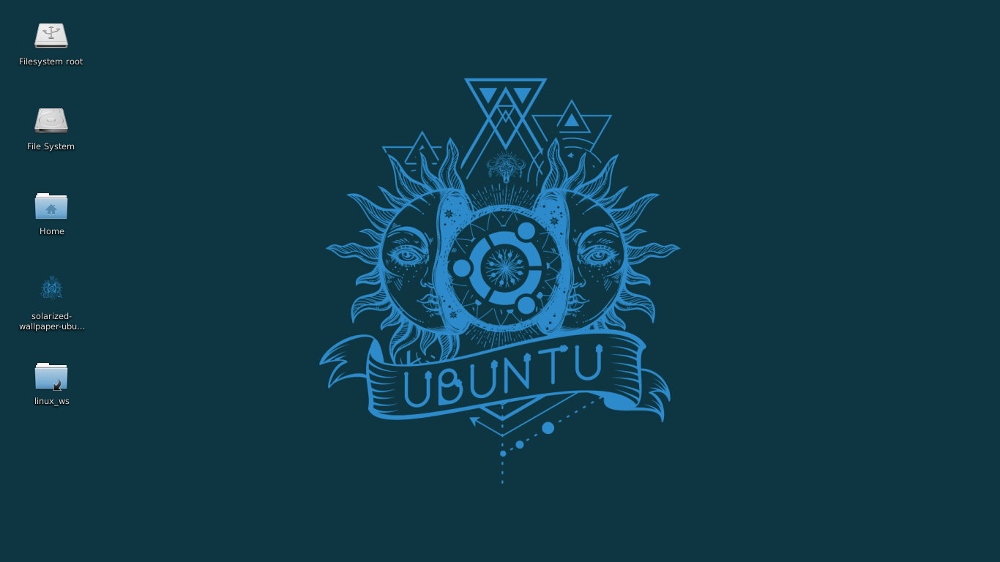

# wsl_linux
Windows subsystem linux with xfce guide

#Intro
In this guide i will show how i set up a full functional linux workstation on the Windows subsystem linux like the one down bellow: 

To do so some minimum skills ins necessary, like write  `.bat` files on windows and do some commands in the linux command line.The scrips and `.bat` files used can be founded in this repository.

#Initial configuration: 
The initial configuration of the `WSL` can be founded in this doc of microsoft:
https://docs.microsoft.com/en-us/windows/wsl/install-win10
The linux distro that i will be covering in this guide is `ubuntu`.
In the final of this initial step covered in the microsoft doc the user will be able to do bash commands, in the next steps will be covered how to set up video and audio in the  `ubuntu` on the `WSL`.

#Video and audio configuration:
*First donwload a Xserver for windows, the Xserver that i use is the `VcXsrv`found is the link: https://sourceforge.net/projects/vcxsrv/
* The Xserver is necessary to the video on the `WSL`.
* Next set up the pulseaudio server on the windows.To do that simply download this script: https://gist.github.com/trzecieu/b46829b2b24c3896c63d4d1b05e2df80#file-install_pulseaudio-bat
* The script install the pulseaudio in windows and initiates alongside it,i found the script in this great guide: https://trzeci.eu/configure-graphic-and-sound-on-wsl/
* After that is time for some configurations on the linux on the `WSL` 
* press `WIN + r` and put `bash` on the command to be initialized
* In the bash do the commands: 
```
sudo add-apt-repository ppa:aseering/wsl-pulseaudio
sudo apt-get update
sudo apt-get upgrade
sudo apt-get install xfce4 xfce4-terminal
sudo apt-get install libpulse0 -y
echo "export DISPLAY=:0.0" >> ~/.bashrc
echo export PULSE_SERVER=tcp:localhost >> ~/.bashrc
```
*After that, with the `VcXsrv` and the `pulseaudio` installed, create a blank file with the name `ubuntu_desktop.bat`, or download the file here on the repository, to create the same file click with the right button of the mouse and go in `EDIT`, and put this:
```
CD "C:\Program Files\VcXsrv"
START vcxsrv.exe :0 -fullscreen -clipboard -wgl
bash.exe -c "export DISPLAY=:0 && export PULSE_SERVER=tcp:localhost && xfce4-session"
PAUSE
``` 
* the first line : `CD "C:\Program Files\VcXsrv"` assumes that you installed in the `Program Files`, if the installed folder was another one change this line.
* 
*Save the file, create a shortcut to this file and click with the right button of the mouse on the shortcut go in advanced and check the run as administrator, this is extra important if you want to use a web browser such as `firefox` or `chromium`, becouse it avoid some lack of permission bugs.
*After that launch the shortcut to the `.bat` file and watch the magic happens. 